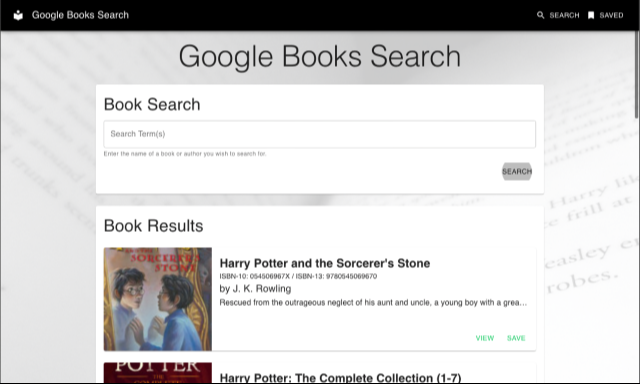

<!-- PROJECT LOGO -->
<div align="center">


# Google Books Search


[](https://www.linkedin.com/in/icn2you/)

_An app that allows users to discover books and curate a reading list_

[View Demo](#usage) · [Report Bug](https://github.com/icn2you/book-search/issues)
</div>
<br>

<!-- TABLE OF CONTENTS -->
<details open="open">
<summary>

## Table of Contents

</summary>

1. [About the Project](#about-the-project)
    - [Built With](#built-with)
2. [Getting Started](#getting-started)
    - [Prerequisites](#prerequisites)
    - [Installation](#installation)
3. [Usage](#usage)
4. [Contributing](#contributing)
5. [License](#license)
6. [Get Help](#get-help)
7. [Acknowledgements](#acknowledgements)

</details>

## About the Project

<div align="center">



</div>

<div align="justify">

Google Books Search is a single-page app (SPA) that allows the user to search for books by title, author, or key words. The app queries Google Books API with the search term(s) and returns relevant results.

Each book result is displayed in its own card. The user can see further details about the book by selecting VIEW or add the book to a reading list by selecting SAVE. The user can return to their curated listby choosing the SAVED option in the upper righthand corner of the page.

</div>

### Built With

Google Books Search is built with the MERN-stack.


<!-- GETTING STARTED -->
## Getting Started

To install and run a local copy of Google Books Search, follow these simple steps:

### Prerequisites

<!--
Acquire an API key for Google Books at [Google APIs](https://console.developers.google.com/apis/credentials).
-->

Install the latest version of npm.

  ```sh
  npm install npm@latest -g
  ```

### Installation

1. Clone the repository (repo).

   ```sh
   git clone https://github.com/icn2you/books-search.git
   ```

2. Install the necessary packages.

   ```sh
   npm install
   ```

3. Launch the app.

   ```sh
   npm run start
   ```

<!-- USAGE EXAMPLE(S) -->
## Usage

<div align="center">


</div>

<!-- CONTRIBUTING -->
## Contributing

### Issues

In case of a bug report or bug fix, please feel free to [open an issue](https://github.com/icn2you/book-search/issues).

<!-- LICENSE -->
## License

This project is distributed under the [MIT License](https://github.com/icn2you/book-search/blob/master/LICENSE).

<!-- GET HELP -->
## Get Help

Contact me at [christopher.zenner@icn2you.com](mailto:christopher.zenner@icn2you.com).

<!-- ACKNOWLEDGEMENTS -->
## Acknowledgements

- [Freepik](https://www.flaticon.com/authors/freepik) (project icon)
- [The Coding Boot Camp @ UCLA Extension](https://bootcamp.uclaextension.edu/coding/)
